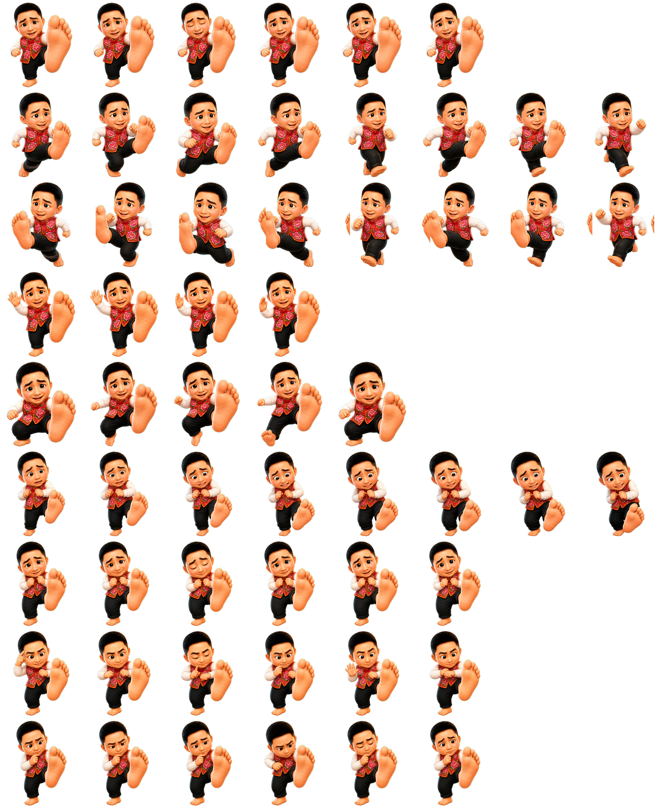
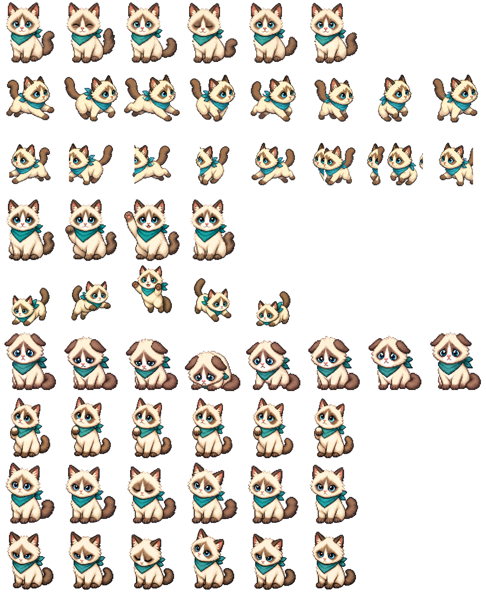

# Codex Pet Cat

Two custom animated pets for Codex: **Difei** and **Mochi Ragdoll Pixel**.

## Pet gallery

<table>
  <tr>
    <td align="center">
      
    </td>
    <td align="center">
      
    </td>
  </tr>
  <tr>
    <td align="center"><strong>Difei</strong></td>
    <td align="center"><strong>Mochi Ragdoll Pixel</strong></td>
  </tr>
  <tr>
    <td align="center">A playful, exaggerated character with a worried smile and an oversized bare sole.</td>
    <td align="center">A fluffy pixel-art ragdoll cat with blue eyes, a teal scarf, and a natural fluffy tail.</td>
  </tr>
</table>

## Installation

### Install both pets

Clone this repository:

```powershell
git clone https://github.com/JingsongWang04/codex-pet-cat.git
Set-Location codex-pet-cat
```

Copy both pet folders into your Codex pets directory:

```powershell
$petsPath = Join-Path $env:USERPROFILE ".codex\pets"
New-Item -ItemType Directory -Path $petsPath -Force | Out-Null

Copy-Item -LiteralPath ".\face-foot-pet" `
  -Destination (Join-Path $petsPath "face-foot-pet") -Recurse -Force

Copy-Item -LiteralPath ".\mochi-ragdoll-pixel" `
  -Destination (Join-Path $petsPath "mochi-ragdoll-pixel") -Recurse -Force
```

Restart Codex after copying the folders, then select the pet you want to use from the pet settings.

### Install one pet only

To install Difei:

```powershell
$petsPath = Join-Path $env:USERPROFILE ".codex\pets"
New-Item -ItemType Directory -Path $petsPath -Force | Out-Null
Copy-Item -LiteralPath ".\face-foot-pet" `
  -Destination (Join-Path $petsPath "face-foot-pet") -Recurse -Force
```

To install Mochi Ragdoll Pixel:

```powershell
$petsPath = Join-Path $env:USERPROFILE ".codex\pets"
New-Item -ItemType Directory -Path $petsPath -Force | Out-Null
Copy-Item -LiteralPath ".\mochi-ragdoll-pixel" `
  -Destination (Join-Path $petsPath "mochi-ragdoll-pixel") -Recurse -Force
```

## Repository structure

```text
codex-pet-cat/
├── face-foot-pet/
│   ├── pet.json
│   └── spritesheet.webp
├── mochi-ragdoll-pixel/
│   ├── pet.json
│   └── spritesheet.webp
└── README.md
```

Each pet package contains:

- `pet.json`: pet metadata and spritesheet configuration.
- `spritesheet.webp`: transparent animated sprite atlas.

## Notes

- These pets use the standard 8-column × 9-row Codex pet spritesheet format.
- Do not rename a pet directory unless you also update the `id` in its `pet.json` file.
- Existing folders with the same names will be overwritten by the PowerShell installation commands above.

## License

No license has been added yet. Unless a license is added, the repository contents remain protected by default copyright rules.
